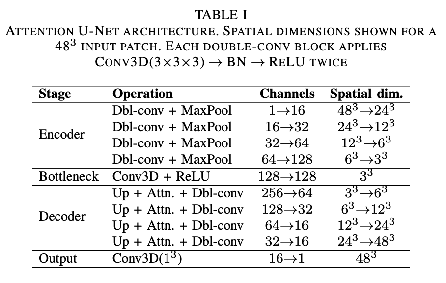
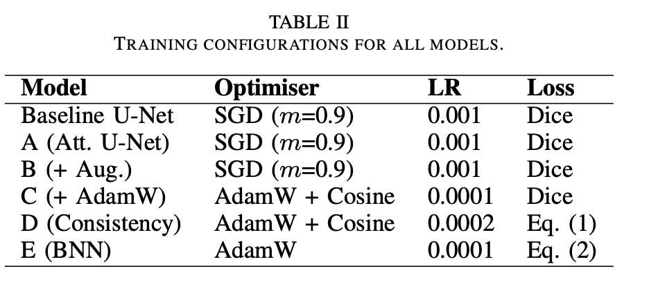
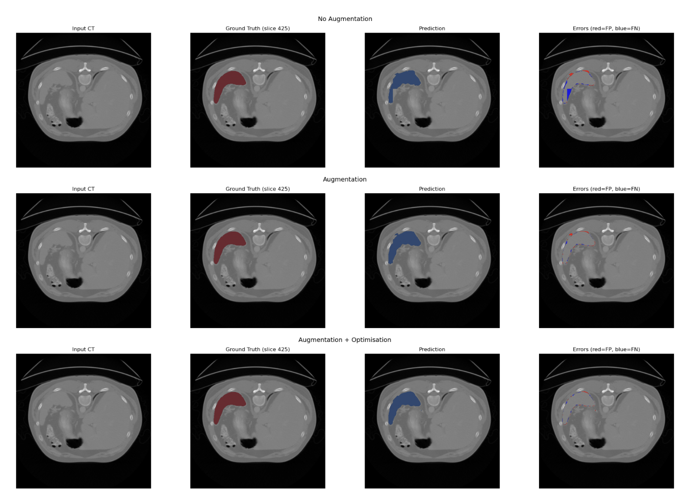
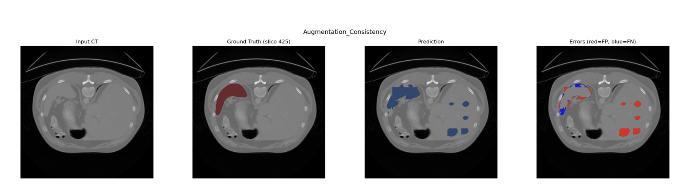
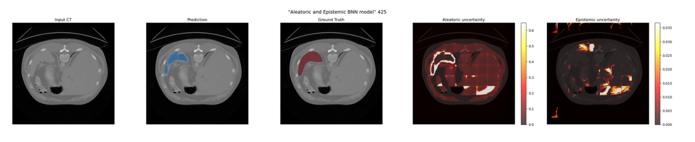
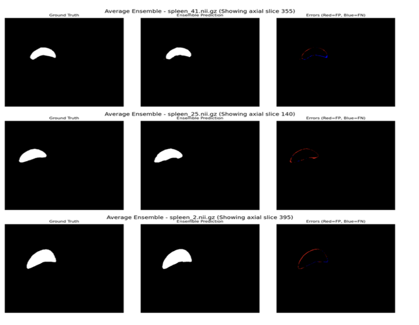

# 3D Spleen Segmentation using Attention U-Net

## Overview
This repository contains a deep learning pipeline for the automated 3D volumetric segmentation of the spleen from Computed Tomography (CT) scans. Accurate spleen segmentation is critical for clinical diagnosis (e.g., splenomegaly) and pre-operative planning. Medical Segmentation decathlon image data was used. 

The project evaluates multiple training configurations on a limited dataset, ultimately achieving a **Dice Score of 0.9232** through cross-architecture ensembling.

## Key Features & Techniques
* **Architecture:** 3D Attention U-Net (Oktay et al.) with a 1mm isometric patch-based sampling strategy (48x48x48).
* **Robust Augmentation:** Implemented Affine and Elastic deformations to simulate realistic scanner positioning and natural spleen volume variations.
* **Uncertainty Estimation:** Explored Bayesian deep learning approaches, including Monte Carlo (MC) Dropout for epistemic uncertainty and custom loss attenuation for aleatoric uncertainty (Kendall et al.).
* **Ensembling:** Built a trilinear resampling pipeline to ensemble predictions across disparate spatial dimensions from independent models.

## Model Configuration

## Results 

## Segmentation performance visualisation

## Ensemble_results 

**Note on Model Failures:** The project includes a critical analysis of semi-supervised consistency and Bayesian Neural Network (BNN) models. The BNN notably collapsed into a variance-exploitation local minimum (Dice: 0.1446), providing valuable insights into the limitations of uncertainty modeling on highly constrained datasets.

## Repository Structure
* `spleen_segmentation_pipeline.ipynb`: The complete executable Jupyter Notebook containing the data pipeline, model architecture, training loops, and evaluation metrics.

## Usage
* Please download image data from medical segmentation decathlon data: http://medicaldecathlon.com
* Model training was originally performed on an HPC cluster using PyTorch 
